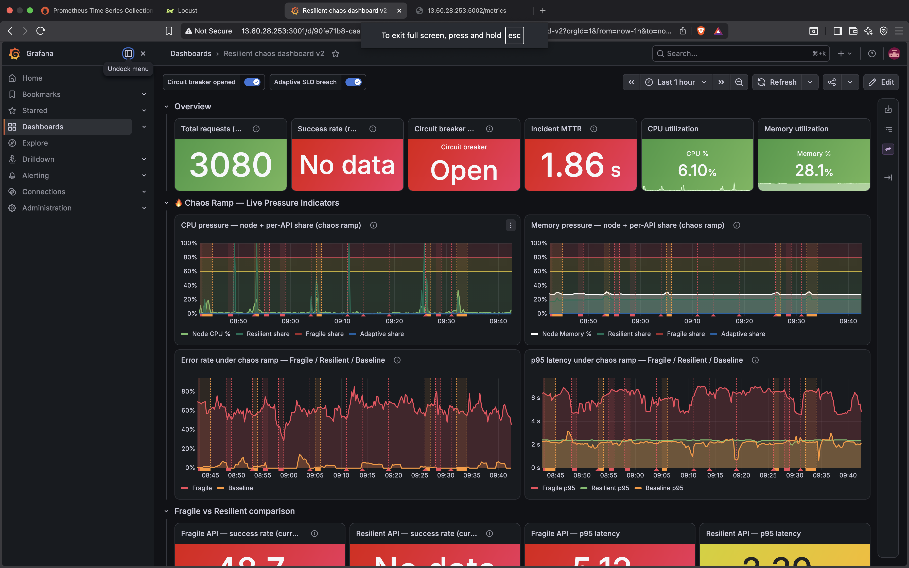
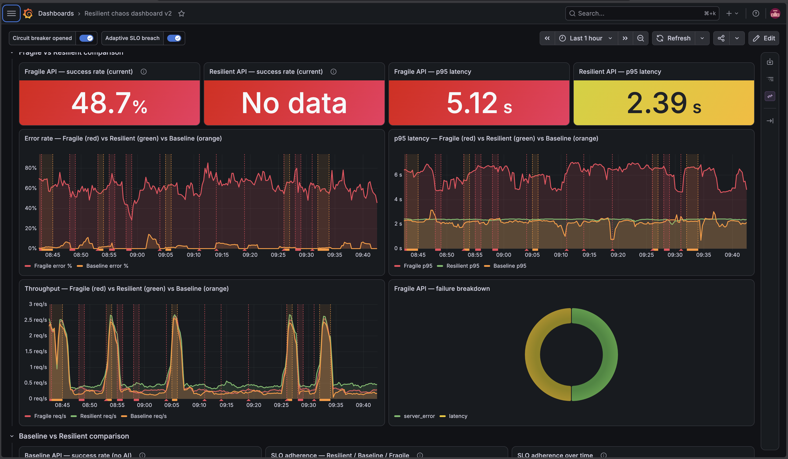
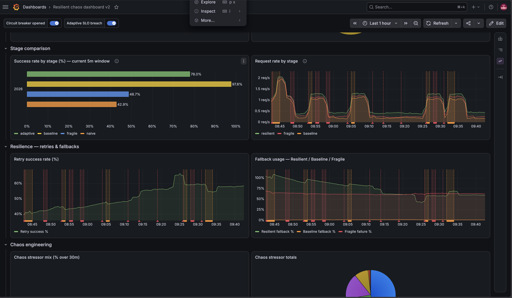
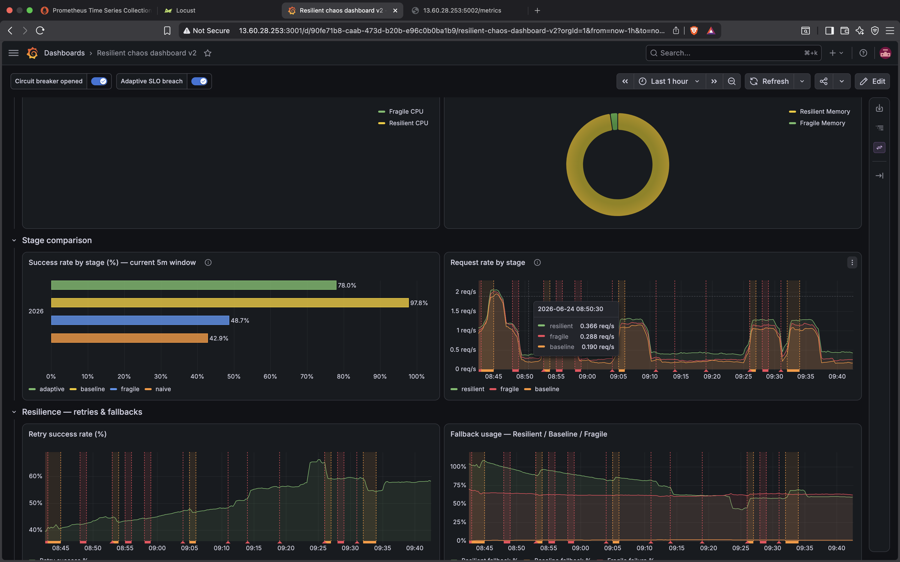
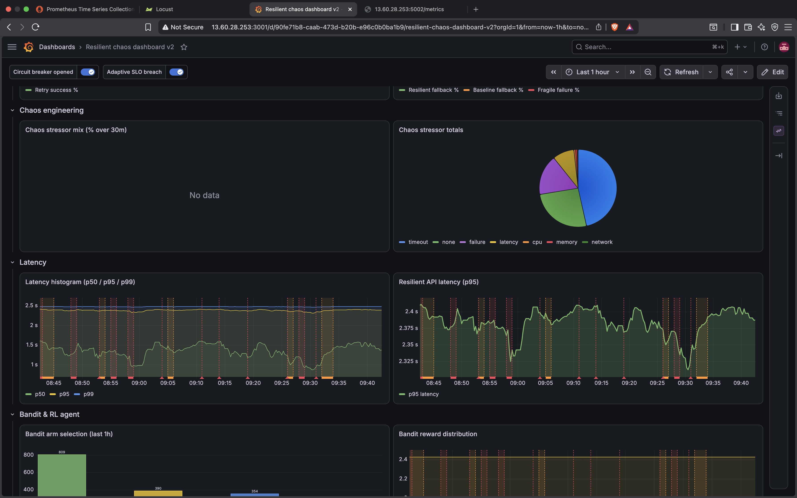
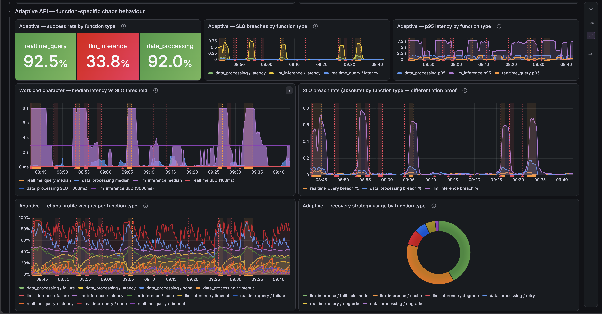

# Resilience-Antifragility Demonstration System

A multi-stage API demonstration system exploring resilience and antifragility patterns in distributed cloud microservices. Built as part of postgraduate research on **adaptive self-healing cloud applications** at Keele University.

Six Flask APIs run under identical chaos conditions, each representing a progressively more sophisticated resilience strategy — from naive failure through to RL-driven antifragile recovery. Metrics are collected via Prometheus and visualised in real time on Grafana.

> **Key finding:** Under sustained chaos load, the Resilient architecture maintained **100% SLO adherence** vs 31% for the Fragile tier — a 3.2× improvement. The antifragility signature observed was **asymmetric SLO oscillation**: the Resilient tier shows deeper initial SLO drops than Baseline under chaos, but actively recovers to 90–95% between events, while Baseline plateaus at 75–80% and cannot climb higher. Fragile collapses to ~15% and stays flat. The RL bandit agent converged on the optimal fallback arm within ~15 minutes of chaos onset.

---

## Resilience Ladder

| API | Port | Strategy | Expected failure rate under chaos |
|-----|------|----------|----------------------------------|
| Naive API | 5002 | No retry, no fallback | ~79% |
| Reactive API | 5002 | Basic retry only | ~22% |
| Fragile API | 5003 | Random fail/slow/ok, no recovery | ~10% |
| Baseline API | 5004 | Retry + circuit breaker, no AI | ~0% at low load |
| Resilient API | 5002 | Circuit breaker + PPO RL + UCB1 bandit + fallback chain | 0% |
| Adaptive API | 5005 | Function-specific chaos profiles + context-aware SLOs | 0% |

> Naive and Reactive are routes within the Resilient API container (port 5002).

---

## Architecture

```
Locust load generator
        │
        ▼
┌─────────────────────────────────────────┐
│          API Layer (Docker Compose)      │
│  Fragile(5003)  Baseline(5004)          │
│  Resilient(5002) ──► Decision engine    │
│    └── PPO RL + UCB1 bandit             │
│    └── Circuit breaker + fallback chain │
│    └── Groq LLM (llama-3.1-8b-instant) │
│  Adaptive(5005) ──► Per-function SLOs   │
└─────────────────────────────────────────┘
        │
        ▼
Prometheus ──► Grafana dashboards
Loki + Promtail (log aggregation)
```

**Chaos injection:** `/chaos/cpu`, `/chaos/memory`, `/chaos/network`, `/chaos/disk`, `/chaos/time`, `/chaos/reset` — all POST endpoints on port 5002.

**LLM role:** Groq `llama-3.1-8b-instant` serves as (1) the protected workload in the fallback chain, (2) confidence-driven routing signal (threshold 0.80), and (3) the `/chaos/analyze` diagnostic endpoint.

---

## 📊 Live Experiment Results

*Captured under sustained chaos load — Locust chaos ramp, ~1 hour window, AWS EC2.*

### System overview — circuit breaker open, chaos ramp active

*3,080 total requests, circuit breaker open, MTTR 1.86s, CPU 6.1%, Memory 28.1%. Error rate divergence between Fragile (red, ~60–80%) and Resilient/Baseline clearly visible under the chaos ramp.*

---

### Fragile vs Resilient — deep dive

*Fragile API success rate: **48.7%** · Fragile p95 latency: **5.12s** · Resilient p95 latency: **2.39s**. Throughput chart shows Fragile's spike-and-collapse pattern vs Resilient's stable steady state. Failure breakdown: server errors (green) vs latency failures (yellow).*

---

### SLO adherence by architecture


| Architecture | SLO Adherence | Error Rate (peak) |
|-------------|:------------:|:-----------------:|
| **Resilient** | **100%** | ~0% |
| Baseline | 74% | up to 13% |
| Fragile | 31% | up to 80% |

*Chaos exposure ratio shows Resilient absorbing ~40% sustained exposure without degradation. Baseline retry exhaustion spikes visible at every chaos event. Resilient p95 latency held within 2.30–2.40s throughout.*

---

### Success rate by stage — current 5-minute window


| Stage | Success Rate |
|-------|:-----------:|
| Adaptive | 78.0% |
| Baseline | 97.8% |
| Fragile | 48.7% |
| Naïve | 42.9% |

*Request rate at 08:50:30: Resilient 0.366 req/s · Fragile 0.288 req/s · Baseline 0.190 req/s. Retry success rate trending upward for Resilient as the bandit agent learns.*

---

### Chaos stressor mix + bandit agent convergence

*Stressor breakdown: timeout (blue, dominant), failure (purple), latency (yellow), CPU (orange), memory (red), network (green). Bandit arm selection over 1h: arm 0 selected 809×, arm 1 selected 390×, arm 2 selected 354× — convergence toward the optimal arm visible. Latency histogram shows p50 ~1s, p95 ~2.5s, p99 ~2.5s held stable.*

---

### Adaptive API — function-specific chaos behaviour

*Context-aware SLO differentiation per function type: **realtime_query 92.5%** and **data_processing 92.0%** success rates held stable, while **llm_inference is permitted to degrade to 33.8%** — correctly identified as a latency-tolerant workload (3000ms SLO vs 100ms for realtime). The workload character chart shows three distinct latency bands managed independently. Recovery strategy donut shows `llm_inference/fallback_model` as the dominant strategy — the LLM workload routes to a cheaper model rather than retrying aggressively. Chaos profile weights shift dynamically per function type across the session, demonstrating true context-aware recovery.*

---

## Prerequisites

- Docker and Docker Compose
- A [Groq API key](https://console.groq.com) — free tier is sufficient (30 RPM limit; run Locust at 3–5 users to stay within it)
- AWS EC2 `t2.medium` or larger, or any Linux host with 2GB+ RAM

---

## Quickstart

**1. Clone the repository**
```bash
git clone https://github.com/J-arobo/Resilience-Antifragility.git
cd Resilience-Antifragility
```

**2. Set your Groq API key**
```bash
cp .env.example .env
nano .env   # paste your GROQ_API_KEY value
```

**3. (Optional) Free up Docker space on a fresh instance**
```bash
docker system prune -a --volumes -f
```

**4. (Recommended) Add swap if running on a small EC2 instance**
```bash
sudo fallocate -l 1G /swapfile
sudo chmod 600 /swapfile
sudo mkswap /swapfile
sudo swapon /swapfile
```

**5. Build and start**
```bash
docker compose up --build -d
```

All services should be running within ~60 seconds. Verify with:
```bash
docker compose ps
```

---

## Running Experiments

### Locust UI (recommended)
Open `http://<host>:8090`, set **Number of users = 3**, **Ramp up = 1**, host = `http://app:5002`, then click Start.

> Keep users at 3–5 to stay within the Groq free-tier rate limit (30 requests/minute). The fallback chain will demonstrate graceful degradation to cache if the limit is hit.

### Chaos blast script
Fires structured chaos rounds (CPU, memory, network) automatically:
```bash
bash ~/test_all_endpoints.sh   # validate all endpoints first
bash ~/chaos_blast.sh          # 5-round chaos injection
```

### Manual chaos injection
```bash
# CPU pressure — 2 cores for 45 seconds
curl -X POST http://localhost:5002/chaos/cpu \
  -H "Content-Type: application/json" \
  -d '{"cores": 2, "seconds": 45}'

# Memory pressure — 80MB for 60 seconds
curl -X POST http://localhost:5002/chaos/memory \
  -H "Content-Type: application/json" \
  -d '{"mb": 80, "seconds": 60}'

# Reset all chaos
curl -X POST http://localhost:5002/chaos/reset
```

### Verify Groq LLM is working
```bash
curl -X POST http://localhost:5002/ai/answer \
  -H "Content-Type: application/json" \
  -d '{"prompt": "say hello"}'
```

Expected response when working:
```json
{
  "answer": "Hello! How can I assist you today?",
  "source": "primary",
  "confidence": 0.92,
  "used_fallback": false
}
```

If `source` is `"cache"` or `"degraded"`, check the Groq rate limit — lower Locust concurrency and retry.

---

## Observability

| Tool | URL | Credentials |
|------|-----|-------------|
| Grafana | http://localhost:3001 | admin / admin |
| Prometheus | http://localhost:9090 | — |
| Locust | http://localhost:8090 | — |

The Grafana dashboard (`Resilient chaos dashboard v2`) is provisioned automatically from `monitoring/grafana/dashboards/`. Set the time range to **Last 10 minutes** with **5s auto-refresh** during a live experiment.

### Key panels to watch

| Panel | What to look for |
|-------|-----------------|
| SLO adherence — Resilient / Baseline / Fragile | Resilient 100% · Baseline 74% · Fragile 31% |
| Error rate — Fragile / Resilient / Baseline | Resilient green line stays flat at 0% |
| CPU pressure — chaos ramp | Spikes correlate with `/chaos/cpu` injection events |
| Bandit arm selection | Convergence toward dominant arm over ~15 minutes |
| Retry exhaustion — Baseline vs Resilient | Baseline exhaustion spikes at every chaos event |
| Adaptive p95 latency by function type | Three SLO bands: realtime_query (100ms), data_processing (1000ms), llm_inference (3000ms) — each managed independently |

---

## Experiment Parameters

| Parameter | Value |
|-----------|-------|
| Stressor weights | none=0.55, latency=0.20, timeout=0.15, failure=0.10 |
| Circuit breaker threshold | 3 consecutive failures |
| Circuit breaker cooldown | 10s |
| SLO latency target (Resilient) | 3000ms |
| SLO tracking window | 100 requests (rolling) |
| LLM model | llama-3.1-8b-instant (Groq) |
| Confidence routing threshold | 0.80 |
| Resilient API memory limit | 512MB |
| Other APIs memory limit | 256MB each |

---

## Project Structure

```
├── apis/
│   ├── app.py              # Resilient API (port 5002) — also serves Naive + Reactive routes
│   ├── fragile_api.py      # Fragile API (port 5003)
│   ├── baseline_api.py     # Baseline API (port 5004)
│   ├── adaptive_api.py     # Adaptive API (port 5005)
│   ├── metrics.py          # Shared Prometheus counters
│   ├── chaos.py            # Bandit policy + chaos executor
│   └── learning.py         # RL training + chaos selector classifier
├── monitoring/
│   ├── prometheus.yml
│   ├── grafana/
│   │   ├── dashboards/     # Auto-provisioned Grafana JSON
│   │   ├── datasources/
│   │   └── provisioning/
│   └── promtail-config.yml
├── load_testing/
│   └── locustfile_chaos_ramp.py
├── scripts/
│   ├── chaos_blast.sh
│   └── test_all_endpoints.sh
├── docs/                   # Dashboard screenshots
│   ├── dashboard-overview.png
│   ├── fragile-vs-resilient.png
│   ├── baseline-vs-resilient.png
│   ├── stage-comparison.png
│   ├── chaos-latency-bandit.png
│   └── adaptive-api.png
├── docker-compose.yml
├── dockerfile.app
├── dockerfile.locust.l
├── requirements.txt
└── .env.example
```

---

## Stopping

```bash
docker compose down        # stop containers
docker compose down -v     # stop and remove volumes
```

---

## Research Context

This system was developed as a practical artefact for postgraduate research into antifragility patterns in distributed systems. The core research question is whether RL-based adaptive strategies produce qualitatively different resilience signatures than classical patterns (retry, circuit breaker) under escalating chaos — demonstrated through the SLO adherence oscillation pattern visible in Grafana.

**Key finding:** Resilient (RL-driven) shows deeper initial SLO drops than Baseline under chaos, but actively recovers to 90–95% between chaos events, while Baseline plateaus at 75–80% and cannot climb higher. Fragile collapses to ~15% and stays flat. This asymmetric oscillation is the antifragility signature.

---

## Reproduction

To reproduce the exact experiment conditions shown in the dashboard screenshots above:

1. Deploy on a `t2.medium` EC2 instance (Ubuntu 22.04)
2. Run `docker compose up --build -d` and wait for all services healthy
3. Open Grafana and confirm the dashboard is provisioned from `monitoring/grafana/dashboards/`
4. Start the chaos ramp Locust file at 3–5 users, spawn rate 1, 60-minute runtime
5. Enable the **Circuit breaker opened** and **Adaptive SLO breach** annotation toggles in Grafana
6. Allow 15–20 minutes for the bandit agent to begin converging

---

## Author

Joseph Arobo · MSc AI and Data Science · Keele University  
GitHub: [J-arobo](https://github.com/J-arobo)
